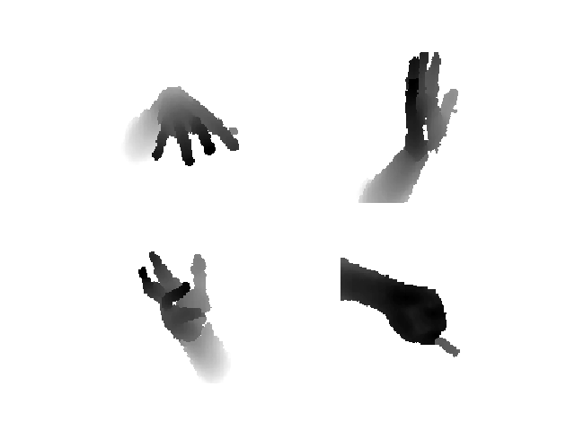
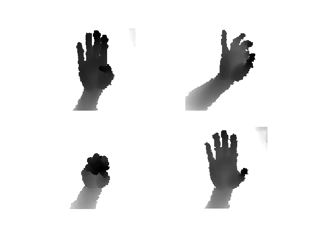
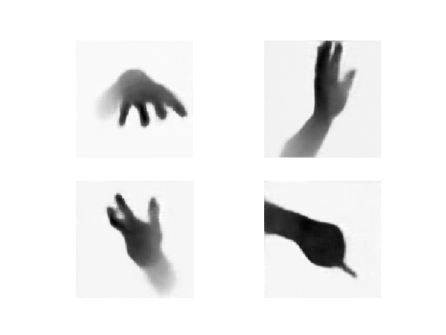
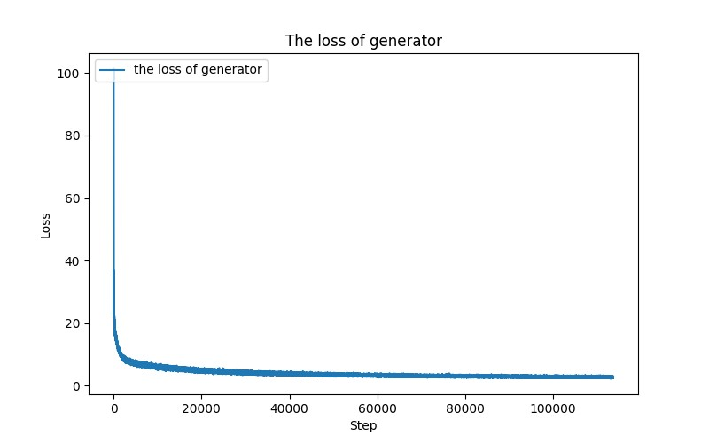

# Generator from hand poses to depth images
**Generator from hand poses to depth images with deconvolution neural network**

The network architecture of the synthesizer used to generate depth images of hand from their poses. The input is hand poses. The fully connected layers at FC4 creates 2048 dimensional latent representation, which is reshaped into 32 feature maps of size 8 * 8. The feature maps are gradually enlarged by successive deconvolution operations. The last layer combines the feature maps to derive a single depth image of size 128 * 128. For the convergence of network, a straightforward way of using this synthesizer is to minimize the squared loss between the input images and the synthetic one by stochastic gradient descent algorithm.  All layers have rectified linear activation, except the last layer which has tanh activation. Each of deconvolutional layers has 32 kernels with the size of 5 * 5 and stride 2. 

Environment:
- Ubuntu16.04 LTS
- TensorFlow　1.4
- Python　2.7
- OpenCV　3.2.0

The train data is augmented NYU dataset from [deep-prior-pp](https://github.com/moberweger/deep-prior-pp). We can get 
152750 depth images, each image shape is (128, 128)

Raw depth image as follows:

|   |  |
| :--------: | :-------: |
|   NO.1     |  NO.２    |

Generated depth image as follows, although I get the smoother depth images compared with raw images,this is just a note of my work. I will get it better.

|   |  |
| :--------: | :-------: |
|   NO.1     |  NO.２    |

The loss curve of generator as follows:

